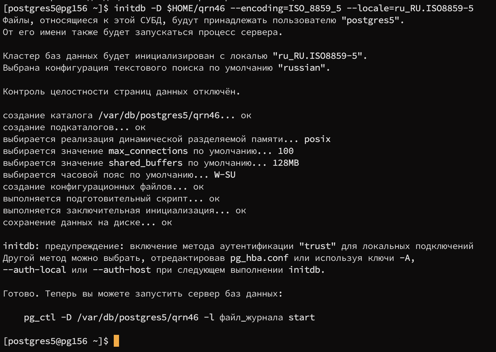
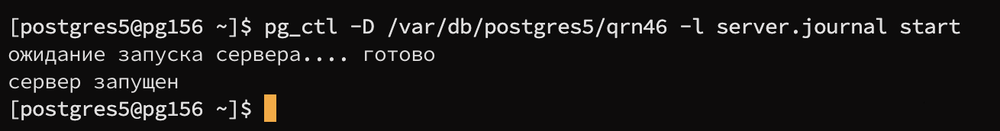
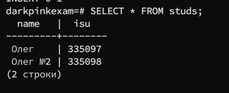
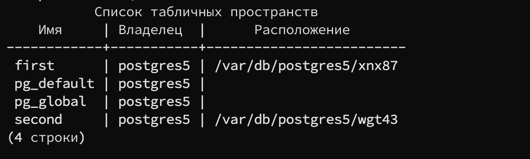
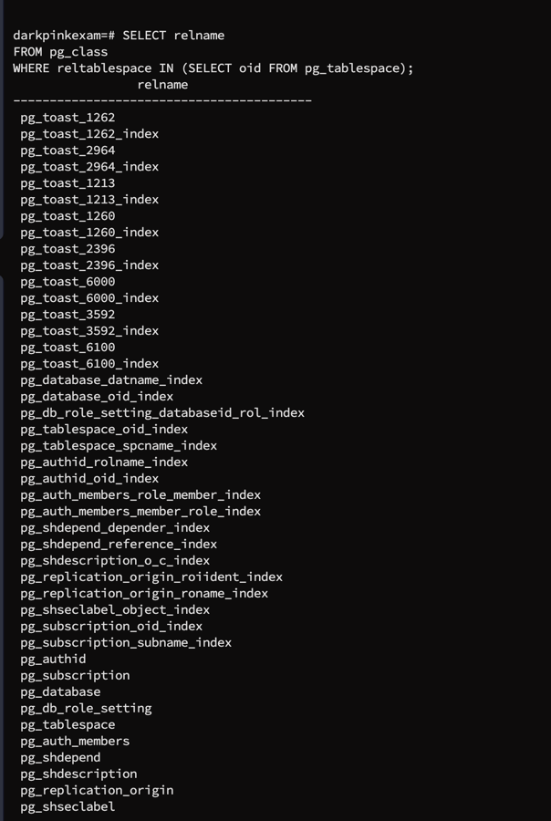

Вариант: **`33161`**

## Задание:


<aside>
🔑 Credentials: pg156:postgres5:Sj/erMgC

</aside>

## Этап #1

### Подключение:

```
ssh -J s335097@helios.cs.ifmo.ru:2222 -> подключение к helios 
ssh postgres5@pg156 -> подключение к postgres5
password: Sj/erMgC -> ввод пароля
```

### Инициализация кластера:

```
initdb -D $HOME/qrn46 --encoding=ISO_8859_5 --locale=ru_RU.ISO8859-5
```



```
pg_ctl -D /var/db/postgres5/qrn46 -l server.journal start
```



## Этап #2
```angular2html
psql -h localhost -p 9161 -U postgres5 -d postgres
password: Sj/erMgC

```

```
[postgres5@pg156 ~]$ cat $HOME/qrn46/postgresql.conf -> файл до изменений
```
---

[Файл postgres.conf до изменений](configs/default/postgresql.conf)

[Файл postgres.conf после изменений](configs/new/postgresql.conf)

---
### Требуется установить для **`postgres.conf`**:

```
# Конфигурация серверного подключения
port = 9161
listen_addresses = '*'

# Максимальное число соединений
max_connections = 8

# Память
shared_buffers = 512MB
temp_buffers = 64MB
work_mem = 64MB

# Контрольные точки
checkpoint_timeout = 15min
wal_buffers = 16MB
max_wal_size = 1GB

# Эффективный размер кэша
effective_cache_size = 2GB

# Безопасность записи
fsync = off
commit_delay = 100000

# Журналирование
log_destination = 'csvlog'
logging_collector = on
log_truncate_on_rotation = on
log_rotation_age = 1d
log_rotation_size = 10MB
log_line_prefix = '%t [%p]: [%l-1] user=%u,db=%d,app=%a,client=%h '
log_connections = on
log_disconnections = on
log_min_messages = info
log_checkpoints = on
log_lock_waits = on
log_temp_files = 0

# WAL
wal_level = replica
archive_mode = on
archive_command = 'cp %p $HOME/ocl34/%f'

# Директория WAL файлов
data_directory = '$HOME/ocl34'

```


```
[postgres5@pg156 ~/qrn46]$ cat pg_hba.conf -> файл до изменений
```

---

[Файл pg_hba.conf до изменений](configs/default/pg_hba.conf)

[Файл pg_hba.conf после изменений](configs/new/pg_hba.conf)

---

### Требуется установить для **`pg_hba.conf`**:

```
# Unix-domain сокеты
local   all             all                                     peer

# TCP/IP подключения
host    all             all             0.0.0.0/0               password
host    all             all             ::/0                    password

```


#### Установка значений: 
```
cat > postgresql.conf
... New data ...

cat > pg_hba.conf
... New data ...
```

#### Перезапускаем систему:
```
 pg_ctl -D $HOME/qrn46 stop
  pg_ctl -D $HOME/qrn46 start
 ```

## Этап 3: Дополнительные табличные пространства и наполнение базы
```
CREATE TABLESPACE first LOCATION '/var/db/postgres5/xnx87';
CREATE TABLESPACE second LOCATION '/var/db/postgres5/wgt43';
CREATE DATABASE darkpinkexam WITH TEMPLATE = template1 TABLESPACE = first;
ALTER DATABASE darkpinkexam SET temp_tablespaces = 'first, second';

CREATE TABLE studs (
name text,
isu integer
);
INSERT INTO studs VALUES ('Олег', 335097);
INSERT INTO studs VALUES ('Олег №2', 335098);
SELECT * FROM studs;
\db

SELECT relname 
FROM pg_class 
WHERE reltablespace IN (SELECT oid FROM pg_tablespace);
```


